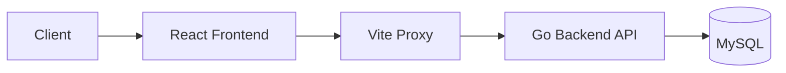

# Book Management (서적 관리)

서적 관리 시스템. Go 백엔드 + React 프론트엔드 구성.

## Architecture

## Tech Stack
- **Backend**: Go 1.25, Gin, MySQL, JWT
- **Frontend**: React, Vite, Tailwind CSS
- **Tools**: Makefile (build/run)

## API Documentation
OpenAPI 3.0 기반. 주요 엔드포인트:
- `/api/auth/*`: 사용자 인증 (register, login)
- `/api/catalog/*`: 물품 및 카테고리 조회
- `/api/admin/*`: 어드민 전용 (물품 CRUD, 유저 승인, 통계, 공지사항)
- `/api/transactions`: 입고/출고 거래
- `/api/history`: 활동 타임라인
- `/api/user/*`: 프로필 및 비번 관리

## Database Schema
주요 테이블 구조:
- `users`: 승인/권한 관리. 상태(`PENDING`/`APPROVED`) 기반.
- `items`: 품목 관리. 코드 기반 유니크 식별.
- `activity_logs`: 작업 이력. 입출고 및 작업방식(`WEB`/`QR`) 기록.
- `announcements`: 공지사항 관리.

## Usage
- `make api`: Run Go backend
- `make web`: Run React frontend
- `make all`: Run both concurrently

## Guidelines
아키텍처 및 코딩 표준 `GEMINI.md` 준수.
